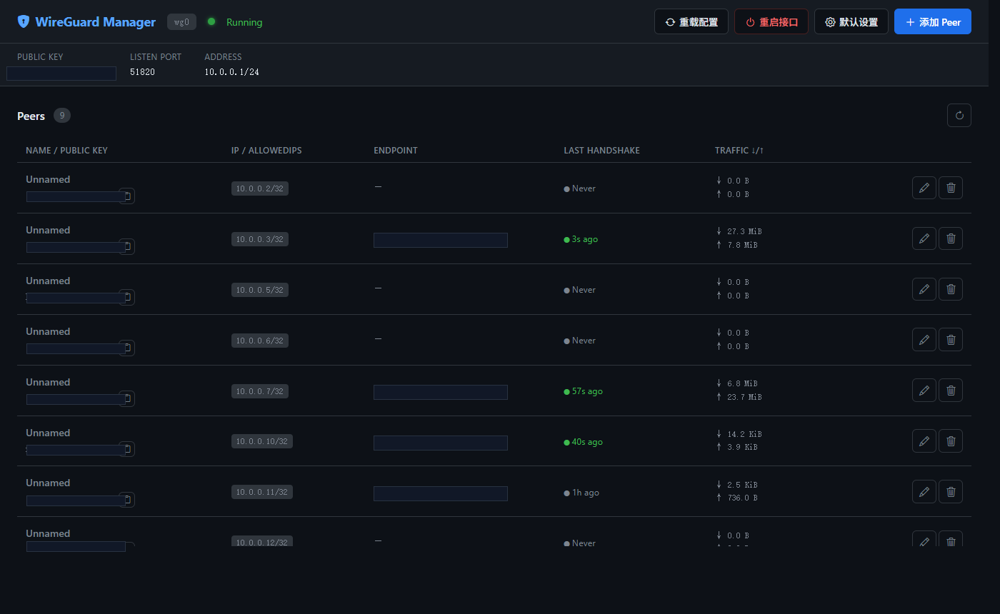

# WireGuard Manager

一个轻量级 WireGuard Peer 管理 Web 界面，通过 SSH 端口转发在本地浏览器访问。



## 功能

- 查看接口状态（公钥、端口、地址）
- Peer 列表：IP、端点、最后握手时间、流量统计、在线状态
- **添加 Peer**：两种模式
  - 自动生成密钥对，弹窗展示私钥/公钥/PSK，可下载或扫码导入
  - 使用已有公钥（客户端自带密钥时）
- **编辑 Peer**：修改名称、AllowedIPs、Keepalive，展示完整公钥可复制
- **删除 Peer**：带确认弹窗
- **客户端配置**：查看/复制/下载 `.conf` 文件，生成 QR 码
- **默认设置**：保存服务器 Endpoint、Keepalive、DNS 等，添加时自动带入
- **重载配置**（`wg syncconf`）：不断开连接地热重载
- **重启接口**（`wg-quick down/up`）：硬重启，带确认提示
- 修改后显示"待应用"提示条，手动决定何时生效

## 文件结构

```
wireguard_html/
├── app.py                  # Flask 后端
├── templates/
│   └── index.html          # 前端单页界面
├── requirements.txt        # Python 依赖（flask、qrcode）
├── install.sh              # 一键安装脚本
├── .gitignore
├── README.md
└── CLAUDE.md               # AI 辅助开发说明
```

## 服务器要求

- Linux（Debian / Ubuntu / CentOS / Fedora 均可）
- 已安装并配置好 WireGuard
- Python 3.8+（install.sh 会自动安装）
- Root 权限（wg 命令需要）

## 部署

### 1. 上传文件到服务器

```bash
scp -r wireguard_html/ user@your-server:/tmp/wireguard_html
```

### 2. 在服务器上安装

```bash
cd /tmp/wireguard_html
sudo bash install.sh
```

脚本会自动：
- 安装 Python3 和 pip
- 创建 `/opt/wg-manager/` 并拷贝文件
- 创建 Python 虚拟环境并安装依赖
- 注册并启动 systemd 服务（开机自启）

### 3. 本地 SSH 转发访问

```bash
ssh -L 5001:127.0.0.1:5001 user@your-server
```

浏览器打开：`http://127.0.0.1:5001`

> 默认端口 5000，若被占用可改为其他端口，详见配置选项。

## 首次使用

1. 打开页面，点右上角 **默认设置**
2. 填入服务器公网 Endpoint（会自动检测，确认即可）、Keepalive（默认 25）等
3. 点 **添加 Peer**，只需填客户端 IP（如 `10.0.0.2`），其余自动带入
4. 添加后点 **重载配置** 使其生效

## 配置选项

通过环境变量配置，在 `install.sh` 运行前设置：

| 变量 | 默认值 | 说明 |
|------|--------|------|
| `WG_INTERFACE` | `wg0` | WireGuard 接口名 |
| `WG_CONFIG_DIR` | `/etc/wireguard` | 配置文件目录 |
| `PORT` | `5000` | Web 服务监听端口 |

示例：

```bash
WG_INTERFACE=wg1 PORT=5001 sudo bash install.sh
```

安装后修改端口：

```bash
sudo sed -i 's/Environment=PORT=5000/Environment=PORT=5001/' /etc/systemd/system/wg-manager.service
sudo systemctl daemon-reload && sudo systemctl restart wg-manager
```

## 服务管理

```bash
# 查看状态
sudo systemctl status wg-manager

# 查看日志
sudo journalctl -u wg-manager -f

# 重启服务
sudo systemctl restart wg-manager

# 停止 + 禁止开机自启
sudo systemctl stop wg-manager
sudo systemctl disable wg-manager
```

## 卸载

```bash
sudo systemctl stop wg-manager
sudo systemctl disable wg-manager
sudo rm /etc/systemd/system/wg-manager.service
sudo rm -rf /opt/wg-manager
sudo systemctl daemon-reload
```

> WireGuard 本身不受影响，只移除管理界面。

## 服务器生成的文件

| 路径 | 说明 |
|------|------|
| `/etc/wireguard/wg0.conf` | WireGuard 配置（直接读写） |
| `/etc/wireguard/clients/<pubkey>.conf` | 各 Peer 的客户端配置（含私钥） |
| `/etc/wireguard/wg-manager-settings.json` | 默认设置（Endpoint、Keepalive 等） |

## 安全说明

- 服务仅监听 `127.0.0.1`，不对外暴露
- 必须通过 SSH 才能访问，安全性依赖 SSH 认证
- 需要 root 权限运行（wg 命令要求）
- 客户端私钥保存在服务器 `/etc/wireguard/clients/`，注意保护该目录

## 联系作者

有问题或建议，欢迎通过微信联系：


## Star History

[](https://star-history.com/#yehx6/wireguard_html&Date)
